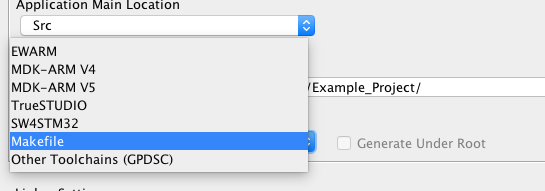
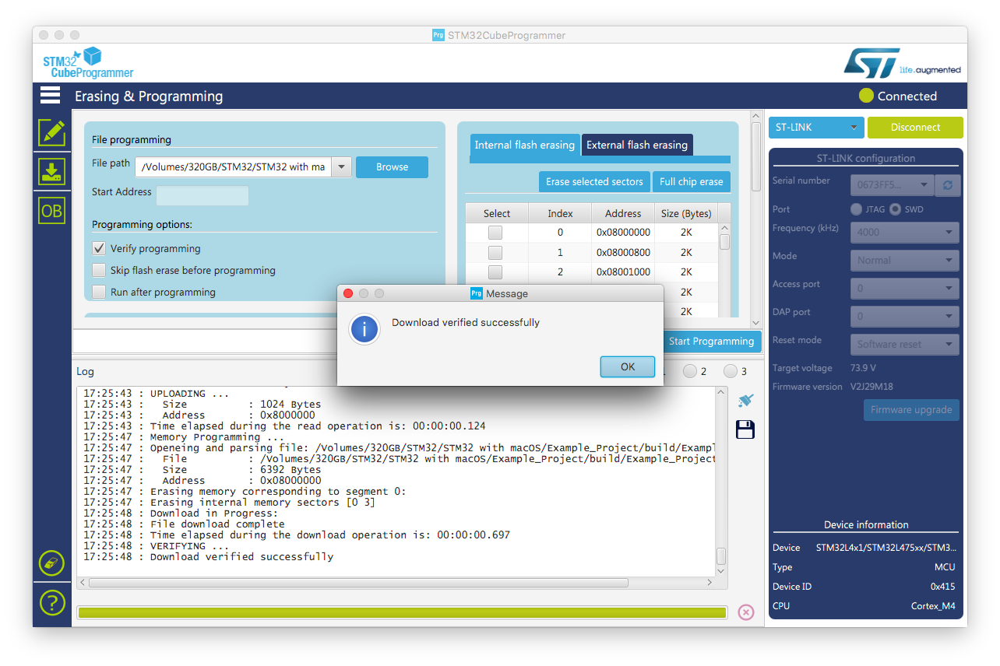

Using GCC and Makefiles on macOS to build STM32CubeMX projects
================================================================

As of v4.21.0, [STM32CubeMX] is now capable of generating Makefiles that can be used to build projects using the [GNU ARM Embedded Toolchain]. Makefiles allow you to be independent of IDEs and use you favorite text editor. For some people, IDEs are slow and take up a lot of resources. With Makefile, building your project is as simple as typing *make* in your Terminal be you in Linux, Mac, or Windows. No more restrictions.

Although this tutorial has been written with macOS in mind, similar steps can be applied to linux or Windows machines.


0 - Installing the toolchain
------------------------
### Requirements:
- [STM32CubeMX] for project template generation
- [STM32CubeProgrammer] for easy programming of STM32 products
- A hardware development board (*e.g.* a [NUCLEO-L476RG] board)
- macOS Command Line Tools (CLT)
- [Homebrew] package manager (recommended to install gcc-arm-embedded, openOCD and stlink)
- [GNU ARM Embedded Toolchain] (arm-none-eabi) for compiler and other tools
- [OpenOCD] (>= 0.10.0) or [texane/stlink] for programming and running a gdb server


1. Install Xcode Command Line Tools:
```Shell
$ xcode-select --install
```
After the Command Line Tools were successfully installed, the remaining toolchain requirements can be installed using Homebrew.

2. Install Homebrew, follow instructions available on [brew.sh][Homebrew]
3. Install GCC ARM Embedded Toolchain:
```Shell
$ brew install gcc-arm-embedded
$ arm-none-eabi-gcc --version
arm-none-eabi-gcc (GNU Tools for Arm Embedded Processors 7-2017-q4-major) 7.2.1 20170904 (release) [ARM/embedded-7-branch revision 255204]
Copyright (C) 2017 Free Software Foundation, Inc.
This is free software; see the source for copying conditions.  There is NO
warranty; not even for MERCHANTABILITY or FITNESS FOR A PARTICULAR PURPOSE.
```

4. Install openOCD:
```Shell
$ brew install openocd
$ openOCD --version
Open On-Chip Debugger 0.10.0
Licensed under GNU GPL v2
For bug reports, read
    http://openocd.org/doc/doxygen/bugs.html
```

5. Install open source [texane/stlink]:
```Shell
$ brew install stlink
$ st-info --version
v1.4.0
```

GL NOTE: see https://github.com/glegrain/WarkaWater/ README.md for out-of-date instructions


1 - Create a Project using CubeMX
-------------------------------
See Getting started from [st.com](http://www.st.com/resource/en/user_manual/dm00104712.pdf). In the Project Settings, under *Toolchain / IDE*, select *Makefile*.



Here, you can use the example "blinky" project:
```
$ git clone https://github.com/glegrain/STM32-with-macOS.git
$ cd STM32-with-macOS/Example_Project
```

2 - Configure your Makefile
-----------------------------
Unfortunately, Makefiles generated by CubeMX do not work *out-of-the-box*, you need to edit the file and set your compiler path. Luckily, this step only has to be done once. Later on, if you want to add source, header files or simply change your compiler options, refer to the [Editing your Makefile] section for more details.

1. Locate the ARM Embedded GCC compiler binary location:
```Shell
$ which arm-none-eabi-gcc
/usr/local/bin/arm-none-eabi-gcc
```

2. Set the `BINPATH` variable to the location of your compiler returned above:
```Makefile
#######################################
# binaries
#######################################
BINPATH = /usr/local/bin
PREFIX = arm-none-eabi-
CC = $(BINPATH)/$(PREFIX)gcc
AS = $(BINPATH)/$(PREFIX)gcc -x assembler-with-cpp
CP = $(BINPATH)/$(PREFIX)objcopy
AR = $(BINPATH)/$(PREFIX)ar
SZ = $(BINPATH)/$(PREFIX)size
HEX = $(CP) -O ihex
BIN = $(CP) -O binary -S
```
**Pro Tip**: To make the Makefile more portable between different users and environment, you can remove the `BINPATH` variable and edit the `CC`, `AS`, `CP`, `AR`, `SZ` as shown bellow. This way, make will look for binaries in your environment (*i.e.* executables located in your `$PATH` setting):
```Makefile
#######################################
# binaries
#######################################
PREFIX = arm-none-eabi-
CC = $(PREFIX)gcc
AS = $(PREFIX)gcc -x assembler-with-cpp
CP = $(PREFIX)objcopy
AR = $(PREFIX)ar
SZ = $(PREFIX)size
HEX = $(CP) -O ihex
BIN = $(CP) -O binary -S
```

3 - Building your project
-------------------------
From your project's root directory (Makefile location), use the `make` command to invoke the Makefile to compile your project:
```Shell
$ make
```
**Pro Tip**: for faster build, make can be invoked using parallel build:
```Shell
$ make -j 4
```

If all goes well, you should see a result without any errors or warning:
```
...
arm-none-eabi-size build/Example_Project.elf
   text    data     bss     dec     hex filename
   8880      24    1688   10592    2960 build/Example_Project.elf
arm-none-eabi-objcopy -O ihex build/Example_Project.elf build/Example_Project.hex
arm-none-eabi-objcopy -O binary -S build/Example_Project.elf build/Example_Project.bin
```

**Pro Tip**: The Makefile template generated by CubeMX comes with a predefined rule called `clean` to delete all generated files during the build process (object files, binaries, ...).
This rule is very useful to force rebuild all or to cleanup the project directory before packaging your project for archiving.
```
$ make clean
rm -fR .dep build
```


4 - Programming the board
-------------------------

### Using STM32CubeProg:
1. Open STM32CubeProgrammer
2. Connect the USB cable
3. Click "Connect"
4. Go to the "Erasing & Programming" window
5.


Note: Because STM32CubeProgrammer is still relatively new, chances are you will have to upgrade your ST-Link firmware.

By default, CubeProgrammer does not run the application after programming. Press the black button to reset and run the firmware. You should see LD2 blinking.

### Using texane stlink:
If all you want to do is program the board, then run:
```Shell
$ st-flash write ./build/*.bin 0x08000000
```
Note: `*.hex` does not appear to work

Otherwise, to program and debug run the gdb server with:
```Shell
$ st-util
```

### Using openOCD:
```Shell
$ ls /usr/local/Cellar/open-ocd/0.10.0/share/openocd/scripts/board/
$ openocd -f scripts/board/stm32l0discovery.cfg
$ openocd -f interface/stlink-v2-1.cfg -f target/stm32l4x.cfg
```

If you installed openOCD using homebrew, you can view a list of provided configuration files in:
```
$ ls /usr/local/Cellar/open-ocd/0.10.0/share/openocd/scripts/target/
```


5 - Debugging
-------------
Because you will be debugging a remote target device, gdb needs to connect to a *gdbserver* compliant debugger. Before launching gdb, you need to start a gdb server using your debugger to act as an interface between gdb and your device.

### Start a gdb server
Using texane stlink, to program and debug run the gdb server with:
```Shell
$ st-util
```

### Launch gdb:

 To program and debug in a single command, I recommend to create a `.gdbinit` script

Here is my `.gdbinit`:
```GDB
file "./build/Example_Project.elf"

# Connect to texane stlink gdb server
target extended-remote :4242
# Or, connect to openOCD instead
# target remote localhost:3333
# monitor reset init
# monitor halt

# Uncomment to enable semihosting
# monitor arm semihosting enable

# Flash program and load symbols
load
break main

# Run to main (first breakpoint)
continue
```

gdb will use `.gdbinit` file
```
$ arm-none-eabi-gdb
...
Loading section .isr_vector, size 0x188 lma 0x8000000
Loading section .text, size 0x1708 lma 0x8000188
Loading section .rodata, size 0x50 lma 0x8001890
Loading section .init_array, size 0x8 lma 0x80018e0
Loading section .fini_array, size 0x8 lma 0x80018e8
Loading section .data, size 0x8 lma 0x80018f0
Start address 0x80017d8, load size 6392
Transfer rate: 9 KB/sec, 1065 bytes/write.
Breakpoint 1 at 0x80016d6: file ./Src/main.c, line 83.
Note: automatically using hardware breakpoints for read-only addresses.

Breakpoint 1, main () at ./Src/main.c:83
83    HAL_Init();
(gdb)
```

### Program stepping/execution:
https://sourceware.org/gdb/onlinedocs/gdb/Continuing-and-Stepping.html
Step over (step to next line of C code without going into functions):
```GDB
(gdb) next
90    SystemClock_Config();
```

Step into (step to next line of C, goes into functions):
```GDB
(gdb) step
SystemClock_Config () at ./Src/main.c:124
124 {
```
Note: Use `stepi` for assembly instruction stepping.

Return from a function:
```GDB
(gdb) finish
Run till exit from #0  SystemClock_Config () at ./Src/main.c:124
main () at ./Src/main.c:97
97    MX_GPIO_Init();
```

Run until next breakpoint:
```GDB
(gdb) continue
Continuing.
```
**Pro Tip**: for most command, you can simply type in the first letter. *e.g.*`n` for `next`.

**Pro Tip**: Press enter to repeat the previous command. Very usefull to quickly step trough a program.

**Pro Tip**: gdb also supports TAB completion. *e.g* `cont` + TAB will result in `continue`.

**Pro Tip**: Use `control` + `c` to stop execution

### Setting a breakpoint:
https://sourceware.org/gdb/onlinedocs/gdb/Breakpoints.html#Breakpoints
http://www.unknownroad.com/rtfm/gdbtut/gdbbreak.html

From there, you can add breakpoints using any of the following methods in the gdb command:

Break on line number and run until breakpoint:
```GDB
(gdb) break main.c:107
Breakpoint 2 at 0x800208e: file ./Src/main.c, line 107.
(gdb) continue
Continuing.

Breakpoint 2, main () at ./Src/main.c:107
107     HAL_GPIO_TogglePin(LD2_GPIO_Port, LD2_Pin);
```

Break on function:
```GDB
(gdb) break SystemClock_Config
Breakpoint 2 at 0x8001fd0: file ./Src/main.c, line 132.
(gdb) continue
Continuing.

Breakpoint 2, SystemClock_Config () at ./Src/main.c:132
132   RCC_OscInitStruct.OscillatorType = RCC_OSCILLATORTYPE_HSI;
(gdb)
```

List breakpoints:
```GDB
(gdb) info break
Num     Type           Disp Enb Address    What
1       breakpoint     keep y   0x0800207e in main at ./Src/main.c:83
    breakpoint already hit 1 time
2       breakpoint     keep y   0x0800208e in main at ./Src/main.c:107
3       breakpoint     keep y   0x08001fd0 in SystemClock_Config at ./Src/main.c:132
```

### Inspecting variables and memory:
```GDB
(gdb) p uwTick
$5 = 11450
```

```GDB
(gdb) x/32x 0x08000000
0x8000000:  0x20018000  0x080017d9  0x08001829  0x08001829
0x8000010:  0x08001829  0x08001829  0x08001829  0x00000000
0x8000020:  0x00000000  0x00000000  0x00000000  0x08001829
0x8000030:  0x08001829  0x00000000  0x08001829  0x08001785
0x8000040:  0x08001829  0x08001829  0x08001829  0x08001829
0x8000050:  0x08001829  0x08001829  0x08001829  0x08001829
0x8000060:  0x08001829  0x08001829  0x08001829  0x08001829
0x8000070:  0x08001829  0x08001829  0x08001829  0x08001829
```

### Manipulating registers:
https://community.st.com/message/178766-reading-io-register-values-with-command-line-
https://gcc.gnu.org/onlinedocs/gcc-7.3.0/gcc/Debugging-Options.html

Include additional debug information, such as all the macro definitions that can be used to inspect I/O registers:
1. Edit you Makefile to add the `-g3` option to the compiler flags
```
CFLAGS += -g3
```

> Level 3 includes extra information, such as all the macro definitions present in the program. Some debuggers support macro expansion when you use -g3.

2. In gdb, type:
```GDB
(gdb) p /x *GPIOA
$4 = {MODER = 0xabfff7ff, OTYPER = 0x0, OSPEEDR = 0xc000000, PUPDR = 0x64000000,
  IDR = 0xc020, ODR = 0x20, BSRR = 0x0, LCKR = 0x0, AFR = {0x0, 0x0}, BRR = 0x0,
  ASCR = 0x0}
(gdb) set GPIOA->ODR ^= 0x20
(gdb) p /x TIM3->CCMR1
```

### View the call stack:
https://sourceware.org/gdb/onlinedocs/gdb/Backtrace.html
```
(gdb) backtrace
#0  HAL_RCC_OscConfig (RCC_OscInitStruct=RCC_OscInitStruct@entry=0x20017fac)
    at ./Drivers/STM32L4xx_HAL_Driver/Src/stm32l4xx_hal_rcc.c:409
#1  0x08001ff4 in SystemClock_Config () at ./Src/main.c:141
#2  0x08002086 in main () at ./Src/main.c:90
```

Other
-----

Advanced GDB:
Using gdb-dashboard (do not use tui mode):
```Shell
$ arm-none-eabi-gdb-py
```

Where to go from here:

Editing your Makefile
---------------------
### Adding source files:
Any additional source file (`*.c` or `*.s`) that needs to be compiled should be added to the `C_SOURCES` or `ASM_SOURCES` variables inside the Makefile.
```Makefile
######################################
# source
######################################
# C sources
C_SOURCES = \
./Src/main.c \
./Src/new_file.c \
./Src/stm32l4xx_it.c \
./Src/syscalls.c \
./Src/system_stm32l4xx.c \

# ASM sources
ASM_SOURCES =  \
./startup_stm32l476xx.s
```
**Pro Tip**: I prefixed my paths with `./` to help vim trigger file path completion.

### Adding Includes:

```Makefile
C_INCLUDES:
```
**Pro Tip**: if the compiler complains about a missing header file for example:
```
./Src/usbd_conf.c:53:10: fatal error: usbd_msc.h: No such file or directory
 #include "usbd_msc.h"
          ^~~~~~~~~~~~
```
use `find . -name "usbd_msc.h"` to get the path and add it to Makefile

### Adding Preprocessor defines:
https://gcc.gnu.org/onlinedocs/gcc-7.3.0/gcc/Preprocessor-Options.html
```Makefile
# C defines
C_DEFS =  \
-DUSE_HAL_DRIVER \
-DSTM32L476xx \
-D__DEBUG__
```


### Changing optimization options:
https://gcc.gnu.org/onlinedocs/gcc-7.3.0/gcc/Optimize-Options.html

Serial console:
---------------
Retargetting the C printf function can be very usefull for debugging or

### Using semihosting:
Semihosting is relatively easy to setup but it is one of the slowest methods for printing debug messages.
Enable semihosting (see example `.gdbinit`)

### Using UART:
On embedded devices, messages

Note: With GCC, make sure to add `syscalls.c`

See [my GitHub gist][uart.c] to retarget printf to UART


Check what USB devices are connected the serial port:
```Shell
$ ls /dev/tty.usbmodem*
/dev/tty.usbmodem413
```

#### screen
```Shell
$ screen /dev/tty.usbmodem413 921600
```
Note: To exit `screen`, press `control-A` then `control-\` and `y`.

#### minicom
```Shell
$ minimum -D /dev/tty.usbmodem413 -b 921600
```


### Using ITM messages over SWO:
with openOCD, ITM can be configured using the `tpiu` command.
https://mcuoneclipse.com/2016/10/17/tutorial-using-single-wire-output-swo-with-arm-cortex-m-and-eclipse/
http://blog.japaric.io/itm/

Understanding compiler options and flags:
https://gcc.gnu.org/onlinedocs/gcc/ARM-Options.html


Resources:
----------
https://developer.arm.com/open-source/gnu-toolchain/gnu-rm
http://www.bravegnu.org/gnu-eprog/
http://blog.japaric.io/quickstart/#hello-world
https://www.gnu.org/software/make/manual/make.html


Issues:
-------
When creating a brand new project (example NUCLEO-L476RG), C source files under Src/ are defined multiple times.

Debugging tips (Part 2?)
- mdw
- flash program
- flash mass_erase
- viewing registers and SFRs
- reg
- mdw
- semihosting
- Linker file


[STM32CubeMX]:http://www.st.com/en/development-tools/stm32cubemx.html
[GNU ARM Embedded Toolchain]:https://developer.arm.com/open-source/gnu-toolchain/gnu-rm
[STM32CubeProgrammer]:http://www.st.com/en/development-tools/stm32cubeprog.html
[Homebrew]:https://brew.sh/
[OpenOCD]:http://openocd.org/
[texane/stlink]:https://github.com/texane/stlink
[NUCLEO-L476RG]:http://www.st.com/en/evaluation-tools/nucleo-l476rg.html

[uart.c]:https://gist.github.com/glegrain/ca92f631e578450a933c67ac3497b4df
